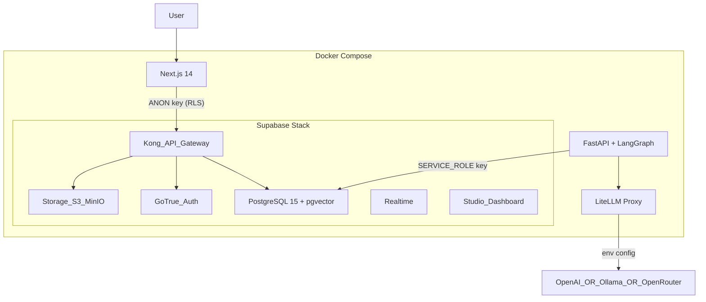
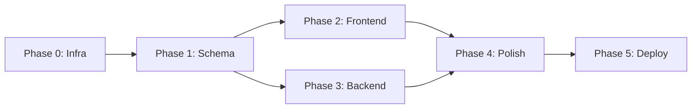

# Roka -- Lean Implementation Plan

## Design Philosophy

**Build the thinnest possible layer on top of battle-tested tools.**

- Supabase = Auth + Storage + Realtime + DB dashboard (free)
- BlockNote = Editor (free)
- LiteLLM = LLM routing to any provider (free)
- LangGraph = Agent orchestration (free)
- Shadcn/Tailwind = UI (free)

What WE build: the schema, the workspace UI, the agent glue.

---

## Architecture (Simplified)




**Key simplification vs. original plan**: No direct HTTP between Frontend and Backend. The Frontend reads/writes DB via Supabase client. The Backend (agent) reads/writes DB via service-role key. They coordinate through the database (sidecar pattern). The only Backend HTTP endpoints are for webhook ingestion.

---

## Sovereignty Levers (Environment Variables)

All "choice" points are env vars in a single `.env` file:

- **LLM**: `LITELLM_MODEL=openai/gpt-4o` or `ollama/llama3` or `openrouter/anthropic/claude-3.5-sonnet`
- **Storage**: Supabase Storage backend configured via `STORAGE_BACKEND=s3` with `S3_ENDPOINT=http://minio:9000` (MinIO) or any S3-compatible endpoint
- **Database**: Supabase wraps PG -- the user gets both raw PG access and the Supabase dashboard
- **Backup**: `pg_dump` cron job + S3 sync to MinIO/external bucket

---

## Phase 0: Infrastructure (Docker Compose)

**Goal**: `docker compose up` boots the entire stack.

**Files to create:**

- `infra/docker-compose.yml` -- services:
  - Supabase stack (use [supabase/docker](https://github.com/supabase/supabase/tree/master/docker) as reference): `db`, `auth`, `rest`, `realtime`, `storage`, `studio`, `kong`, `meta`
  - `litellm` -- LiteLLM proxy container, configured via env vars for provider/model
  - `backend` -- Python 3.11, mounts `./backend`
  - `frontend` -- Node 20, mounts `./frontend`
- `infra/.env.example` -- all config: PG credentials, JWT secrets, Supabase keys, LiteLLM model config, S3/MinIO endpoints
- `infra/litellm-config.yaml` -- LiteLLM model routing config
- Update `.gitignore` -- add `node_modules/`, `.next/`, `infra/.env`

**Ports exposed:**

- `3000` -- Frontend
- `8000` -- Supabase Studio
- `8080` -- Supabase Kong (API)
- `8100` -- Backend API (webhooks only)

---

## Phase 1: Database Schema

**Goal**: Single `database/init.sql` that creates the hybrid schema.

**Tables** (from `specifications/db.md`, simplified for v1):

```sql
-- Extensions
CREATE EXTENSION IF NOT EXISTS vector;
CREATE EXTENSION IF NOT EXISTS pg_trgm;

-- Zone A: Fixed Core
-- entities: canonical "who" (people, orgs, bots)
-- communications: immutable signal log

-- Zone B: Flexible Shell (THE CORE)
-- nodes: atomic unit (page, database, database_row, image)
--   - parent_id self-ref for tree structure
--   - content JSONB for BlockNote editor state
--   - properties JSONB for user-defined fields (GIN indexed)
--   - search_text TEXT generated column for full-text search (tsvector indexed)
-- edges: semantic links (source_id, target_id, type)
-- database_definitions: schema for database nodes

-- Zone C: Agent State
-- agent_tasks: triggered workflows with status tracking
-- checkpoints: LangGraph serialized state
-- writes: agent modification audit log
```

**RLS Policies:**

- `nodes`: users see only their own + shared workspace nodes
- `entities`, `communications`: read-all for authenticated, write via service-role only
- `agent_tasks`: users see their own tasks

**Full-text search:**

- Generated column `search_text` on `nodes` combining `content` text extraction
- GIN index with `to_tsvector('english', search_text)`
- `pg_trgm` index for fuzzy matching

---

## Phase 2: Frontend -- Workspace Shell

**Goal**: Working Notion-like workspace with auth, sidebar, and page rendering.

This is the largest phase -- broken into sub-steps.

### 2a: Project Bootstrap

- `frontend/package.json` with: `next@14`, `react`, `@supabase/supabase-js`, `@supabase/ssr`, `@blocknote/react`, `@blocknote/core`, `@tanstack/react-table`, `@tanstack/react-query`, `tailwindcss`, `zustand`, `zod`
- `frontend/Dockerfile`
- Shadcn UI init (`npx shadcn-ui@latest init`)
- `frontend/lib/supabase/client.ts` + `server.ts` -- browser and server Supabase clients (ANON key)
- `frontend/app/layout.tsx` -- root layout with providers (QueryClient, Supabase)

### 2b: Auth Pages

- `frontend/app/auth/login/page.tsx` -- email/password login via Supabase Auth
- `frontend/app/auth/signup/page.tsx` -- registration
- `frontend/middleware.ts` -- protect `/workspace/*` routes, redirect unauthenticated users

### 2c: Workspace Layout

- `frontend/app/workspace/layout.tsx` -- sidebar + main content area
- `frontend/components/sidebar/WorkspaceTree.tsx` -- recursive tree of `nodes` where `type = 'page'`, fetched via Supabase client. Drag-and-drop reordering (parent_id updates).
- `frontend/components/sidebar/SearchDialog.tsx` -- command palette (Cmd+K) that queries `nodes` via full-text search

### 2d: Page Editor

- `frontend/app/workspace/[nodeId]/page.tsx` -- dynamic route, fetches node, renders editor or grid based on `node.type`
- `frontend/components/editor/PageEditor.tsx` -- BlockNote editor bound to `nodes.content`. Debounced auto-save (update `content` JSONB via Supabase client on change).
- `frontend/components/editor/PageHeader.tsx` -- editable title, icon, cover image

### 2e: Database Views

- `frontend/components/grid/DatabaseView.tsx` -- TanStack Table. Reads `database_definitions.schema_config` for column definitions. Rows are child `nodes` where `type = 'database_row'`.
- Cell types: text, number, select, date, person (linked entity), checkbox
- Inline editing: cell changes write to `nodes.properties` JSONB
- Views: table (default), later: board (kanban), list

### 2f: Search

- `frontend/lib/queries/search.ts` -- React Query hook calling Supabase RPC for full-text search across `nodes`
- Results grouped by type (pages, database rows)
- Keyboard-driven (Cmd+K opens, arrow keys navigate, Enter opens)

### 2g: Homepage/Dashboard

- `frontend/app/workspace/page.tsx` -- default workspace view
- Recent pages, pinned pages, quick actions
- "Agent Tasks" section showing active/completed `agent_tasks` with status
- Button to trigger new agent workflows (writes to `agent_tasks` table)

---

## Phase 3: Backend -- Agent Service

**Goal**: FastAPI app that runs LangGraph workflows triggered by database events.

### 3a: Project Bootstrap

- `backend/pyproject.toml`: `fastapi`, `uvicorn`, `pydantic>=2`, `supabase`, `asyncpg`, `langgraph`, `langchain-core`, `langchain-openai`, `litellm`, `httpx`
- `backend/Dockerfile`
- `backend/app/main.py` -- FastAPI app with lifespan (init DB pool)
- `backend/app/config.py` -- Pydantic `Settings` from env
- `backend/app/db.py` -- AsyncPG pool + Supabase service-role client

### 3b: Agent Task Poller

- `backend/app/services/task_runner.py` -- Background task that polls `agent_tasks` table for `status = 'pending'`. Picks up task, sets `status = 'running'`, invokes LangGraph workflow, sets `status = 'completed'` or `'failed'`.
- This is the bridge between frontend (creates task row) and backend (executes it). No HTTP between them -- pure sidecar via DB.

### 3c: First Workflow -- Summarize

- `backend/graph/workflows/summarize.py` -- LangGraph StateGraph:
  - Input: node_id
  - Step 1: Fetch node content from DB
  - Step 2: Call LLM (via LiteLLM) to summarize
  - Step 3: Write summary back to node properties
- Simple but proves the full pipeline: UI trigger -> DB row -> agent pickup -> LLM call -> DB write -> UI sees result via Supabase Realtime

### 3d: Second Workflow -- Smart Triage

- `backend/graph/workflows/triage.py` -- the Cognitive Graph from the spec (simplified):
  - Classify content (LLM)
  - Extract entities/dates (LLM)
  - Create linked nodes (tasks, references)
- Operates on a node or communication, creates child nodes

### 3e: Webhook Ingestion (the only HTTP endpoint)

- `backend/app/routes/webhooks.py` -- receive external events (email, Slack)
- Parse, resolve entity, persist to `communications`, create `agent_task`

---

## Phase 4: Search + Polish

**Goal**: Make everything searchable and the UX feel solid.

- **Global search**: full-text across `nodes` (content + properties) + `entities` (display_name + resolution_keys)
- **Workspace settings**: user profile, workspace members (multi-user), API keys for LLM
- **Breadcrumbs**: show page hierarchy in editor view
- **Keyboard shortcuts**: Cmd+K (search), Cmd+N (new page), Cmd+S (force save)
- **Error boundaries**: BlockNote crash doesn't kill the page
- **Loading states**: Suspense boundaries + skeleton loaders

---

## Phase 5: Deployment + Backup

**Goal**: One-command deploy anywhere.

- `infra/docker-compose.prod.yml` -- production overrides (no Studio, built images, resource limits)
- `infra/fly.toml` -- Fly.io config (or `render.yaml` for Render)
- `infra/backup/backup.sh` -- cron script: `pg_dump` + upload to S3/MinIO
- `infra/backup/restore.sh` -- restore from backup
- `README.md` -- updated quickstart: `cp .env.example .env && docker compose up`
- ARM64 compatible images for Raspberry Pi deployment

---

## What We're NOT Building in v1

- Live collaboration (Yjs/Hocuspocus) -- v2
- Agent visualizer (React Flow) -- v2
- Vector/semantic search (pgvector embeddings) -- v2 (full-text is enough for v1)
- Complex NER/extraction pipelines -- v2
- Board/kanban views -- v2
- File upload/attachment management -- v2 (Supabase Storage is ready, UI can wait)
- Mobile responsive -- v2

---

## File Count Estimate


| Area                          | Files | Complexity |
| ----------------------------- | ----- | ---------- |
| Not using table - using list: |       |            |


- **infra/**: ~5 files (compose, env, litellm config, dockerfiles) -- straightforward
- **database/**: 1 file (init.sql) -- medium (schema + RLS + indexes)
- **frontend/**: ~25-30 files (pages, components, hooks, lib) -- bulk of the work
- **backend/**: ~15 files (FastAPI app, 2 LangGraph workflows, services) -- medium

**Total**: ~45-50 files. Tight, focused codebase.

---

## Build Order + Dependencies




Phases 2 and 3 can be built **in parallel** after Phase 1. Phase 2 is the critical path (largest).